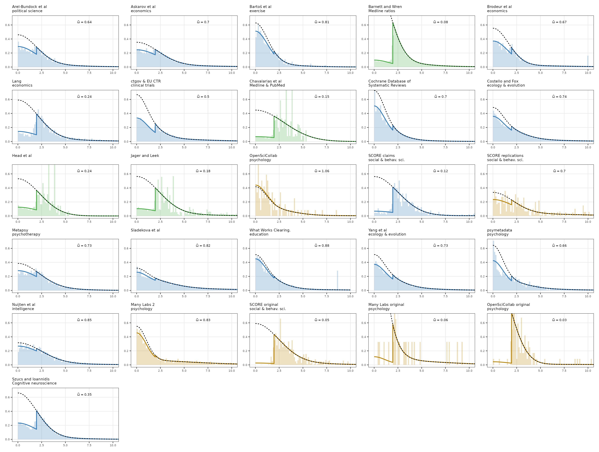

BEAR fits a mixture model to the absolute z-values in each dataset. The model
allows a Hedges-style selection effect: results with $|z| < 1.96$ may be
observed at a lower rate than results with $|z| \geq 1.96$
[@hedges1984estimation; @hedges1992modeling].

The fitted selection parameter is

$$
\omega =
\frac{\Pr(\text{observed} \mid |z| < 1.96)}
     {\Pr(\text{observed} \mid |z| \geq 1.96)}.
$$

Values below one indicate lower observation probability below the conventional
two-sided significance threshold. The solid curve is the fitted observed
distribution of absolute z-values; the dashed curve shows the corresponding
distribution after removing the fitted selection effect.

{.selection-mixture-plot fig-alt="Multi-panel BEAR mixture model plot showing fitted selection parameters for every current fitted mixture"}
