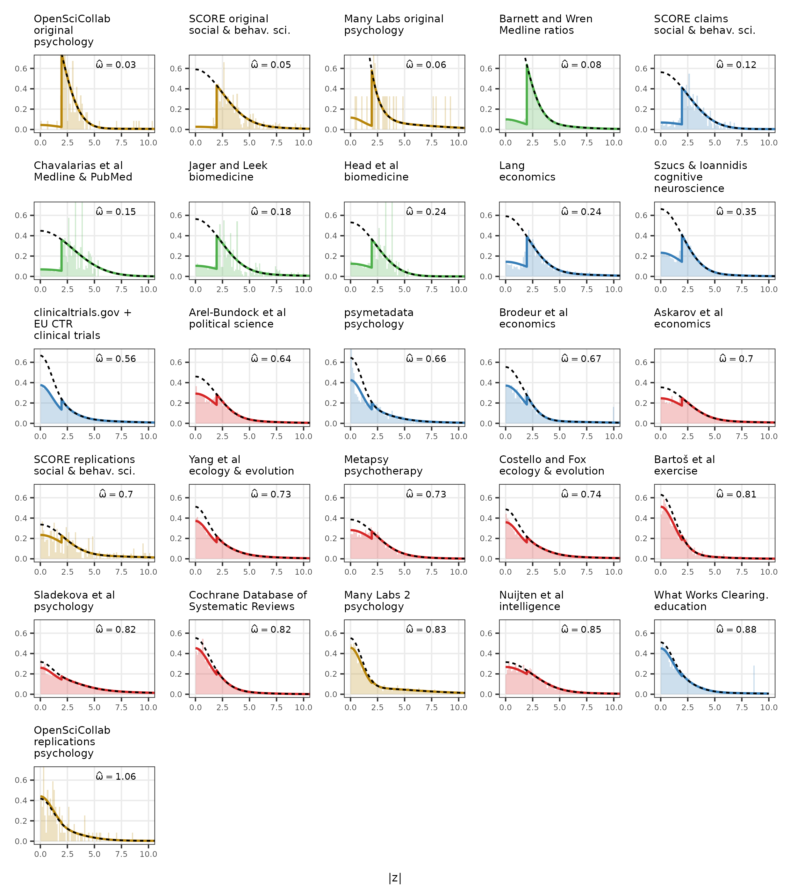

**You can treat this small page as a demonstration of how heterogeneity in
metascientific parameter can be explored using BEAR data. I will expand on this
and add explorations for other parameters in the future.**

In addition to data, BEAR also includes a default (but optional!) mixture model 
of absolute z-values in each dataset. The model has a Hedges selection component: 
results with $|z| < 1.96$ may be observed at a lower rate than results with $|z| \geq 1.96$
[@hedges1984estimation; @hedges1992modeling].

The selection parameter is

$$
\omega =
\frac{\Pr(\text{observed} \mid |z| < 1.96)}
     {\Pr(\text{observed} \mid |z| \geq 1.96)}.
$$

Values below one indicate a lower probability of observation below the
conventional two-sided significance threshold.

The solid curve is the fitted observed distribution of absolute z-values; the
dashed curve shows the corresponding distribution after removing the fitted
selection effect.

{.selection-mixture-plot fig-alt="Multi-panel plot of BEAR mixture models showing fitted selection parameters for every current mixture"}

*Panels are ordered by fitted $\hat\omega$. Colours denote dataset families:
blue for curated datasets, red for meta-analysis datasets, green for
article-wide harvests, and gold for replications of original studies.*

There is no consistent interpretation of $\omega$ here, since what each z-value 
represents changes across datasets. 
In datasets where each observation is a focal estimate from a
paper, $\omega$ could be interpreted as a publication bias parameter. 
In datasets that extract many coefficients from the same paper, however, 
selection does not operate independently on each coefficient: a paper may be published because of one main result while other coefficients appear because they are reported alongside and were chosen by authors because they are simply interesting or 
comprise secondary analyses. In these cases, $\omega$ is better interpreted as 
selection of reported results. Any comparisons across datasets should therefore
take this factor into account; we can proxy by it by looking at number of observations per
paper and whether the extracted estimates are pre-specified/focal estimates.

